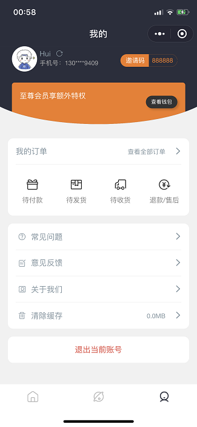
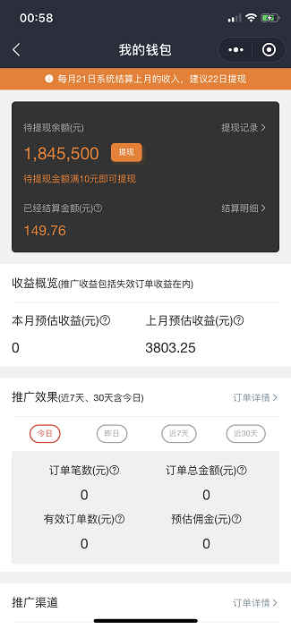
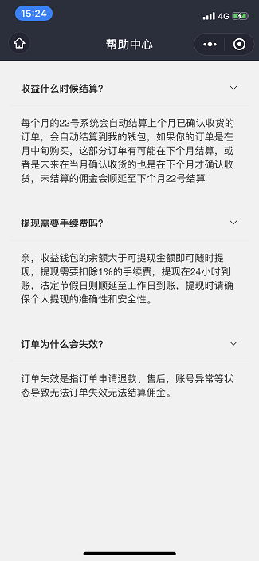
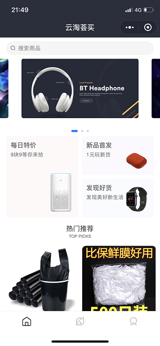
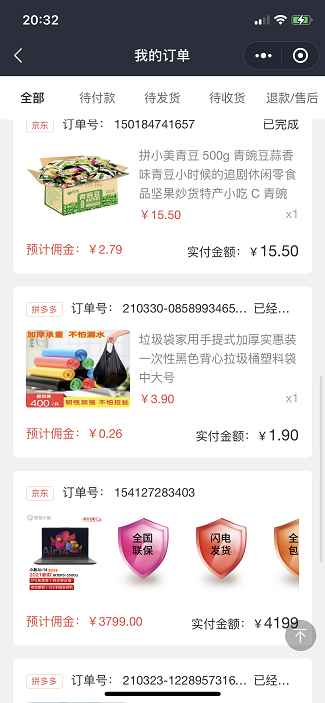
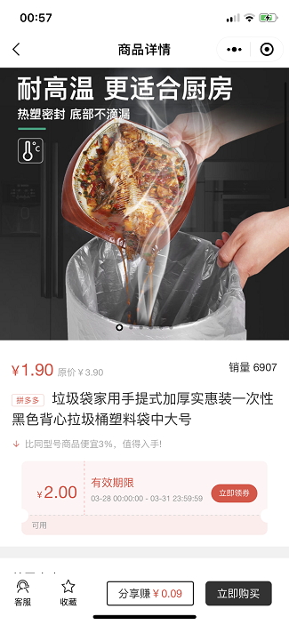
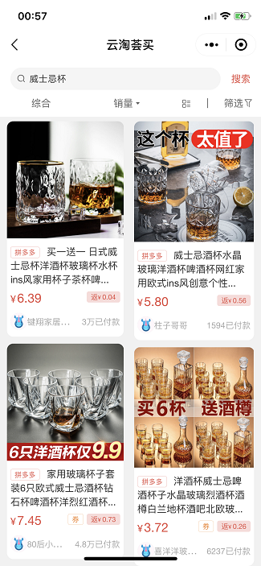
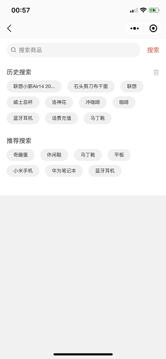

# 淘客商城小程序

*云淘荟买小程序汇集了多个巨头电商平台，比如京东、拼多多、唯品会等，以及主流的外卖电商平台美团、饿了么等*

> 耗时半年的细心打磨下研发出小程序，纵观市面上开放的返利商城，我们开发的这款小程序在UI设计，视觉，操作上更胜一筹，也更符合客户理想的商城模式，优秀的设计风格。

**前端**选择了更为优秀的多端跨平台框架Uniapp框架，我们致力于多端统一、多端运行（目前兼容微信小程序）的目标前进。

**后端**选择了PHP框架中最为优秀的laravel框架，在技术选型和开发上我们细心打磨，为了融合多个平台商品数据不一致的情况，我们专业的技术团队多次讨论、推敲，只为能给客户带来最为优秀的作品，

# 体验版本

# 界面样式
        
